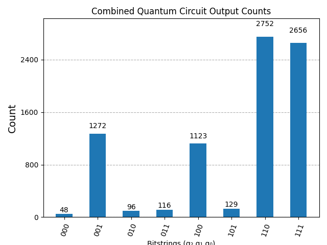

# 3-Qubit Quantum Circuit Sampler (Qiskit + IBM Quantum)

This project creates a 3-qubit quantum circuit using [Qiskit](https://qiskit.org/) and [IBM Quantum](https://quantum-computing.ibm.com/) to for simulating temporal consistency in the presence of retrocausality and coexisting multiverse configurations. The circuit is executed on the least busy *real* IBM Quantum backend, with a fallback to simulator, and results are visualized using a histogram.

---

## Features

-  Custom 3-qubit quantum circuit
-  Transpilation for real quantum backends
-  Execution via Qiskit's `Sampler` primitive
-  Visualization of output bitstring frequencies

---

## Circuit Overview

```plaintext
  q0: ──H─■────■────M──
           │      │
  q1: ──H──X──X───■───M──
                 │
  q2: ────────────X───M──
```

- Qubit 2 is initialized to `|1⟩`
- Creates a Bell pair between `q0` and `q1`
- Applies a Toffoli (CCX) gate with `q0` and `q1` as controls and `q2` as target

---

## Requirements

Install the necessary dependencies:

```bash
pip install qiskit qiskit-ibm-runtime matplotlib
```

Set up your IBM Quantum account (only needed once):

```python
from qiskit_ibm_runtime import QiskitRuntimeService
QiskitRuntimeService.save_account("MY_IBM_QUANTUM_API_TOKEN")
```

---

## How to Run

Save the script as `quantum_sampler.py`, then execute it:

```bash
python quantum_sampler.py
```

This will:
1. Connect to IBM Quantum.
2. Identify the least busy real backend.
3. Transpile and execute the quantum circuit.
4. Print result counts and show a histogram plot.

---

## Output Example

Console Output:
```text
Job ID: cr9g1m3qb72kq9qvl7bg
 > Counts for pub 0: {'110': 4050, '111': 4102, '010': 20, ...}
```

Histogram (example):



---

## License

This project is licensed under the MIT License.  
See the [LICENSE](LICENSE) file for more information.

---

## Contributions

Pull requests are welcome! Feel free to fork this repo and experiment with the circuit or execution parameters.

---

## 📢 Contact

Questions? Reach out via [GitHub Issues](https://github.com/your-username/your-repo/issues).
